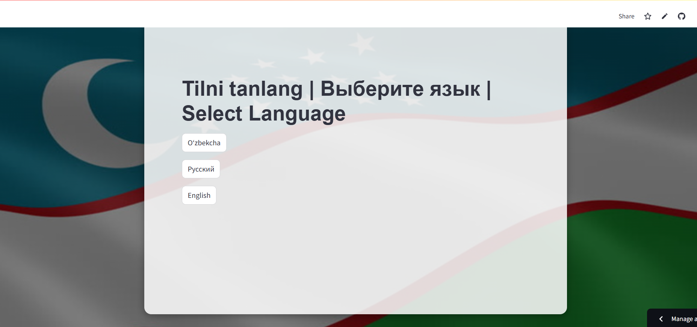
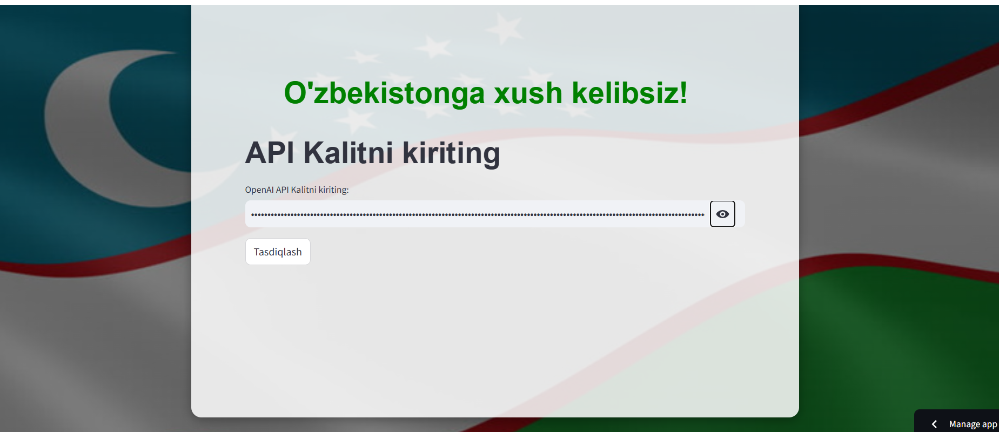
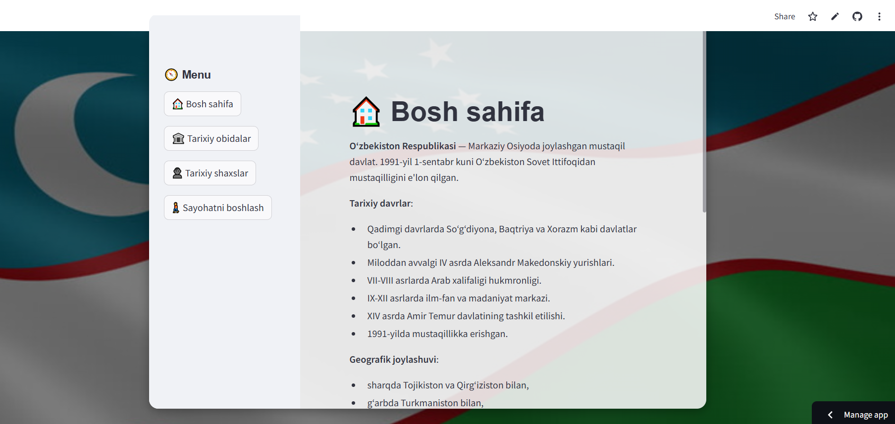
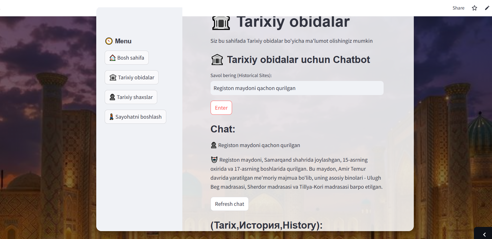
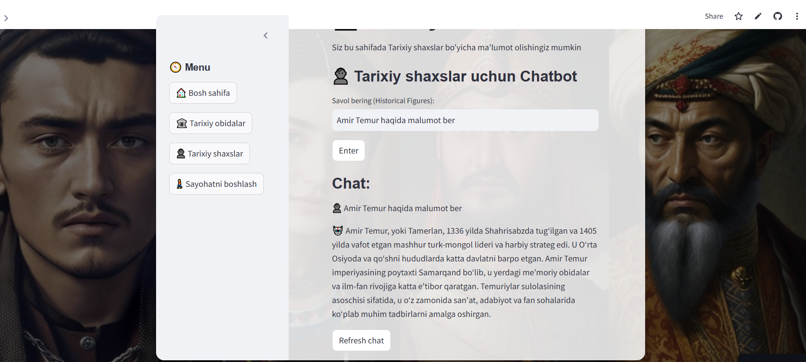
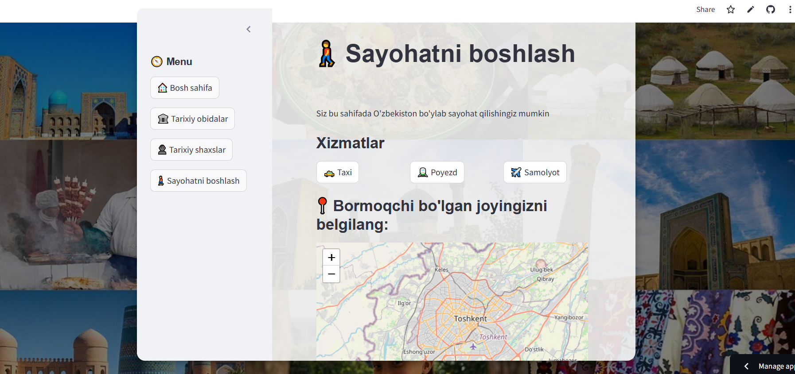

# README.md  

## Uzbekistan Travel Chatbot: Interactive Guide to History, Culture, and Transportation  

This project is a **Streamlit-based interactive web application** designed to guide users through Uzbekistan’s rich historical, cultural, and travel-related services. The app provides personalized responses for different areas of interest, such as historical monuments, historical figures, and travel services like taxis, trains, and flights.  



---

## Key Features  

### 1. **Multi-Page Interface**  
The app is structured into four main sections:  
- **Home**: General chatbot focused on Uzbekistan’s social, economic, and political aspects (excluding historical topics).  
- **Historical Sites**: Information about historical monuments in Uzbekistan.  
- **Historical Figures**: Insights about historical figures and great scholars from Uzbekistan.  
- **Travel Start**: Travel services, maps, and location-based assistance.  

### 2. **Dynamic Chatbot Functionality**  
Each section has its own chatbot with tailored knowledge and a specific scope. For example:  
- **Home Chatbot**: Focuses on Uzbekistan’s general topics, excluding historical figures or sites.  

- **Historical Sites Chatbot**: Specializes in Uzbekistan’s monuments, excluding other topics.
  
- **Historical Figures Chatbot**: Provides information about Uzbekistan's notable historical figures.
  
- **Travel Start Chatbot**: Offers travel guidance based on user-selected services and locations. 
 

### 3. **Interactive Map**  
The **Travel Start** page integrates a Folium-based map where users can select a location. The chatbot then tailors travel guidance based on the chosen coordinates.  

### 4. **Session Management**  
The app stores session data such as chat history, selected services, and user inputs. Each chatbot's conversation history is preserved independently.  

---

## Technologies Used  

### **Backend**  
- **OpenAI GPT-4 API**: For generating intelligent and context-specific responses.  
- **Streamlit**: To build the interactive web interface.  

### **Frontend**  
- **Folium**: For rendering interactive maps.  
- **Streamlit Components**: For displaying text, user inputs, and dynamic buttons.  

---

## How to Run the Application  

1. **Clone the Repository**:  
   ```bash  
   git clone <repository_url>  
   cd <repository_name>  
Install Dependencies:
Make sure Python 3.8+ is installed. Install required packages using:

```
pip install -r requirements.txt  
```
Set Up OpenAI API Key:
Add your OpenAI API key to the environment variables:

```
    export OPENAI_API_KEY="your_openai_api_key"  
```
Run the Application:

bash```
    streamlit run app.py 
```
Access the App:
O
How to Use
General Navigation
Use the sidebar to switch between pages:
    Home
    Historical Sites
    Historical Figures
    Travel Start
Chatbot Interaction
Type your query in the input box.
Click Enter to receive a response.
Use the Refresh Chat button to clear chat history for a fresh start.
Interactive Map (Travel Start Page)
Use the Folium map to select a location.
Based on your selection, the chatbot will provide customized travel guidance.
Project Structure
plaintext

📂 Project Folder  
│  
├── app.py                      # Main Streamlit app  
├── requirements.txt            # Python dependencies  
├── README.md                   # Project documentation  
└── .env                        # OpenAI API Key  
Future Improvements
Multi-Language Support: Add Uzbek, Russian, and other regional languages for broader accessibility.
Advanced Travel Services: Integration with real-time transportation APIs for ticket booking and schedules.
Enhanced Map Features: Allow saving multiple destinations or creating travel itineraries.

Author
Developed by [Haqnazar].
For questions or suggestions, feel free to contact at [khaknazareshankulov@gmail.com].


